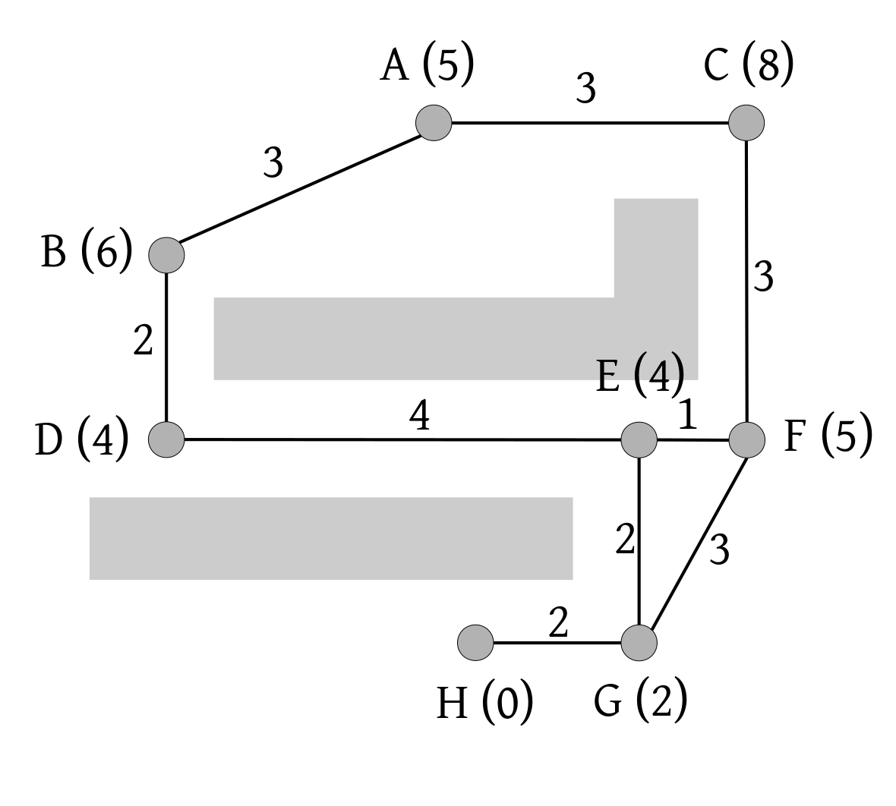
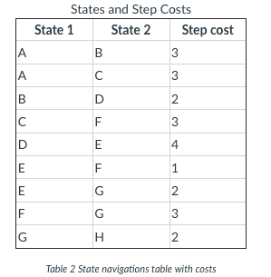
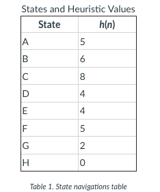

## Activity: Obstacles

The task is to get a robot to the other side of a room, avoiding two large obstacles on the way. 
A diagram of the state space is shown below. Each grey circle is a state, labelled A-H. 
Lines between states are the transitions and they are labelled with their step cost. 
Each state also has a number in brackets: this is the value of the heuristic function h(n) for that state.



The tables below show the heuristic value of each state, and the step cost for each connection between two states. Connections between two states can be navigated in both directions (with the same step cost). 





You might have noticed something odd about the distances. For example, if the robot were to travel 
in a straight line from F to G, the distance should be less than 3 according to Pythagoras’ theorem. 
The reason is that the robot can only move north, south, east or west, so to get from F to G it 
must travel south for two steps, and west for one step, hence a distance of 3.

The heuristic values are not straight-line distances, as they are in the Romania example. 
They are in fact the number of steps to reach H assuming there are no obstacles, 
and given that the robot can only move in four directions. This heuristic is called 
the Manhattan distance, and you will see it again in the next lesson. 
The **Manhattan distance** is an admissible and consistent heuristic for this problem.

```
The robot starts in state A, and the goal is to arrive at state H.

Apply Greedy Best-First Search (the Graph Search version) to this problem. Note down the frontier set at each step. Does it find the optimal solution in this case? If not, why not?

Apply A* Search (the Graph Search version) to this problem. Note down the frontier set at each step, and the f-cost (i.e. the value of the evaluation function) of each node. Does A* Search find a different solution?

Apply the Tree Search version of A* Search to this problem. With a tree search algorithm the frontier can contain multiple nodes with the same state (but usually different path costs).

Hint: when executing A* Search by hand, it is useful to record the path costs of nodes in the frontier. For example, a frontier could be written as [D/5, F/6], where the number after the / is the path cost.
```